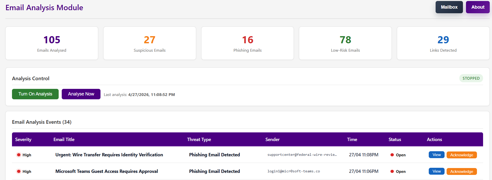
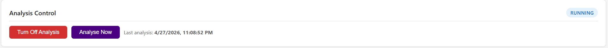
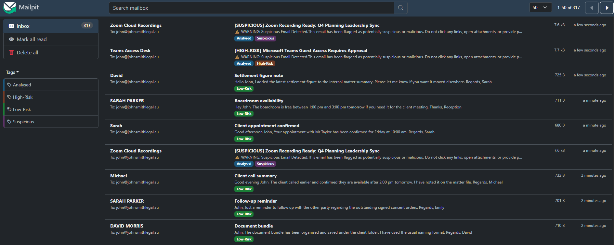
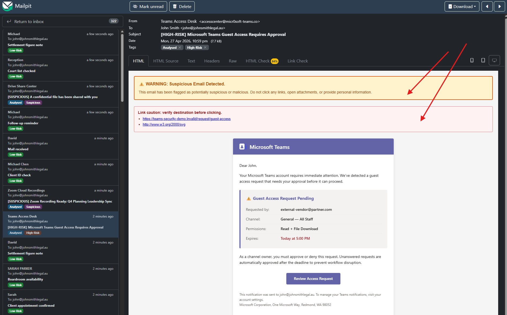

# 📧 Email Analysis Guide

## 📌 Overview

Cyber threats have evolved significantly over time, with many attacks now originating from malicious emails targeting unsuspecting users.

---

## ✅ What this tool does

The Email Analysis feature helps mitigate these risks by:

- Connecting to an email service to scan incoming emails for threats  
- Continuously monitoring all incoming emails in real-time  
- Tagging suspicious emails and highlighting potentially dangerous links  
- Warning users when an email is identified as malicious or high-risk  

---

## 🧭 Accessing the Email Analysis Page

Navigate to **"Email Analysis"** from the left sidebar of the application.

---

## ⚠️ Accessing the Email Mailbox (Important)

> 🚨 **Important:** This step is required to fully demonstrate the feature.

Use the following mailbox:

👉 **http://mail.heml.cc**

This is a **simulated mailbox environment** used for demonstration purposes.

- No login or setup is required  
- Emails are automatically generated and sent to this mailbox  
- This avoids using real email providers while still demonstrating full functionality  

> 💡 Keep this page open while using the Email Analysis feature to observe live updates.

---

## ▶️ Using Email Analysis

On the Email Analysis page, you will see system statistics followed by options to:

- Start continuous email monitoring  
- Perform a one-time scan of existing emails  

---

### 🔄 Continuous Monitoring

Click **"Turn On Analysis"** to begin real-time email scanning.

Once enabled:
- The system will continuously check for new emails  
- Incoming emails will be automatically analysed  

---

### 📬 Live Mailbox Updates

While monitoring is active, the mailbox will update in real-time:

- Emails will be tagged based on threat level  
- Suspicious content (e.g. links) will be highlighted  

---

### ⚠️ Threat Warnings

Clicking on a **High-Risk** or **Suspicious** email will display warning messages to the user.

---

## ✅ Expected Outcome

- Emails are analysed as they arrive  
- Threat levels are clearly indicated  
- Users are warned before interacting with potentially malicious content  

---

> ⚠️ **Note:**  
> This system uses a simulated mailbox environment for safe demonstration of email-based threats.
