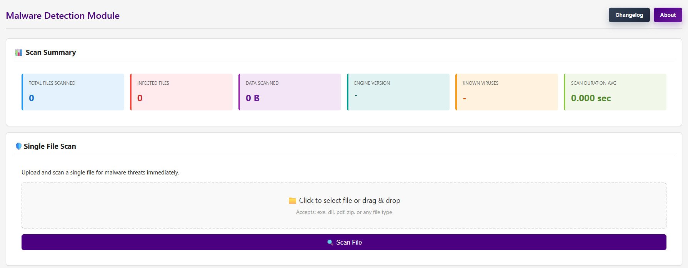
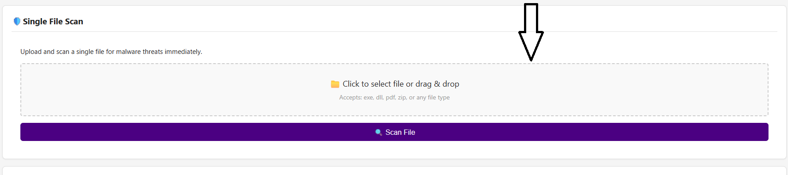
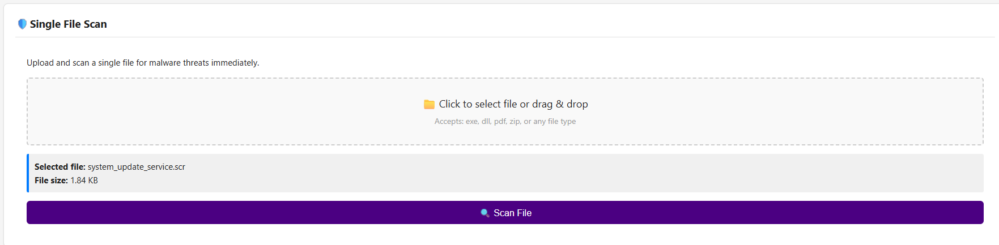
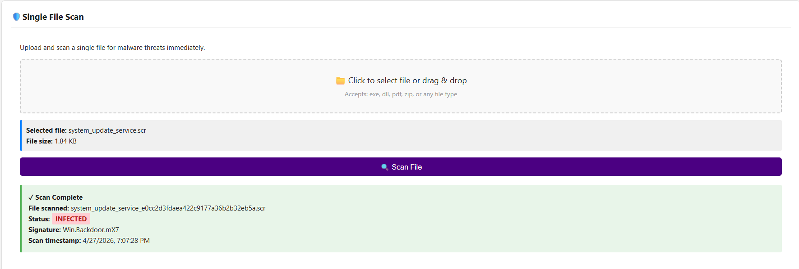
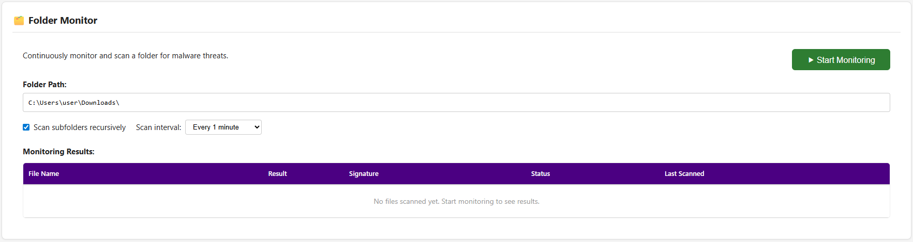
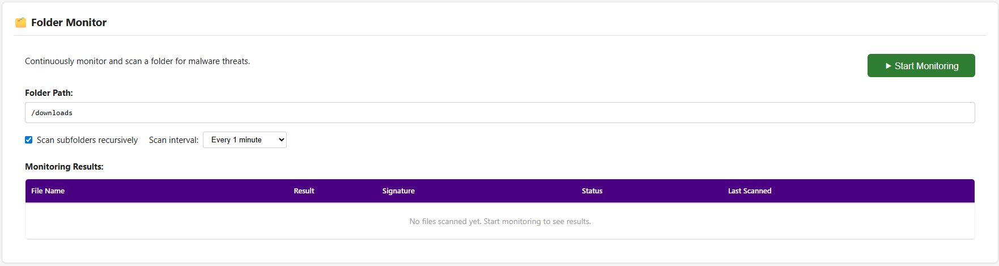
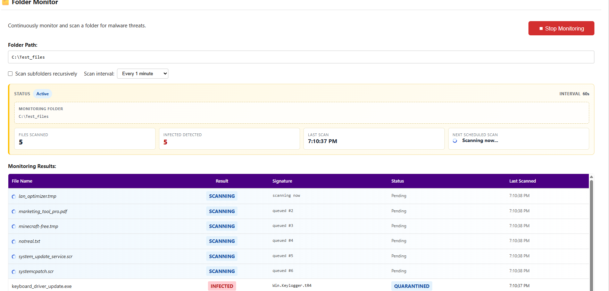
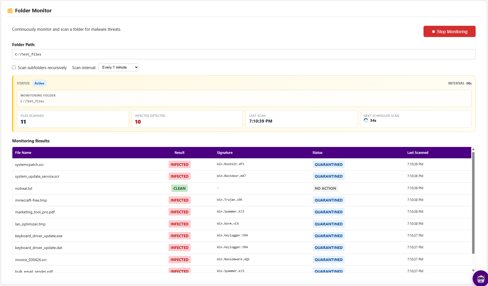

# 🛡️ Malware Detection Guide

## 📌 Overview

Cyber threats can often come from files or programs downloaded from the internet.  
In many cases, it is not possible to determine whether a file is malicious through simple inspection.

### ✅ What this tool does

The Malware Detection feature helps mitigate these risks by:

- Allowing users to upload and scan individual files for malware, viruses, or suspicious activity  
- Providing a continuous folder monitoring system that automatically scans files at set intervals  
- Enabling background scanning of commonly used directories (e.g. Downloads folder)  

---

## 🧭 Accessing the Malware Detection Page

Navigate to **"Malware Detection"** from the left sidebar in the application.

---

## 📄 Single File Scan

At the top of the page, you will see system statistics followed by the **Single File Scan** section.

### 🔍 Steps

1. Click inside the upload area (grey box), or drag and drop a file from your computer

   
3. A confirmation message will appear once the file has been uploaded

5. Click **"Scan File"** to begin analysis  
6. The scan result will be displayed immediately below  

---

## 📁 Folder Monitoring

The Folder Monitor allows continuous scanning of a selected directory.

---

### 🖥️ Local Usage

If running the application locally:

1. Enter a folder path into the input field  
   Example:

   C:\Users\user\Downloads\

   

---

### 🌐 Demo Environment

If using the hosted demo (e.g. `demo.heml.cc`):

- Local file paths will **not work**
- Use the following demo directory instead:

   /downloads

This folder is pre-filled with files for demonstration purposes.
**If there are no results from /downloads please reset to default and try again!**

---

### ⚙️ Configuration Options

- **Scan Interval**  
  Set how frequently the folder is scanned  

- **Scan subfolders recursively**  
  When enabled, all subfolders will also be scanned  

---

## ▶️ Start Monitoring

1. Configure your folder and scan settings  
2. Click the green **"Start Monitoring"** button  

Once started:
- The system will begin scanning immediately  
- If files are present in the folder, results will appear in the table below  

---

## ✅ Expected Outcome

- Files will be scanned automatically based on your interval  
- Results will indicate whether files are safe or potentially malicious  
- New files added to the folder will also be detected and scanned  

---

> ⚠️ **Important:**  
> Folder monitoring works best when the application is running locally with access to your file system.
